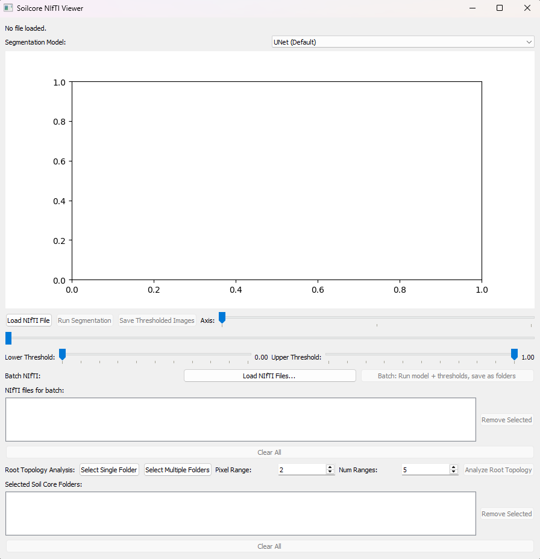
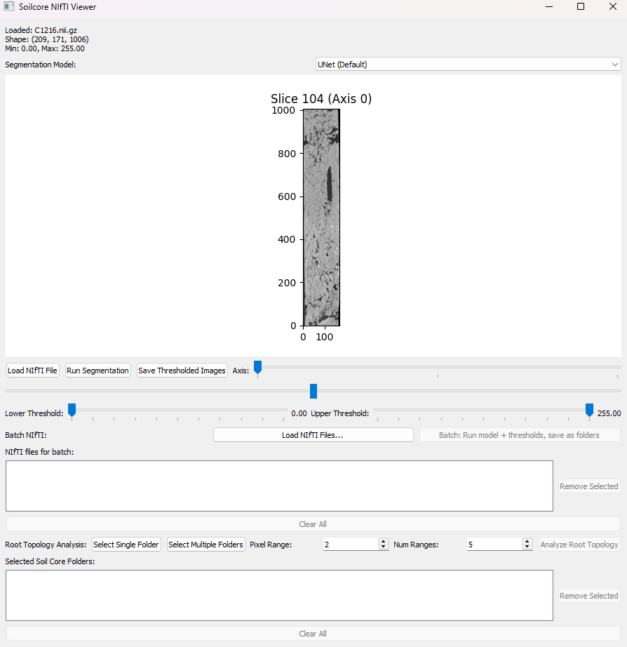
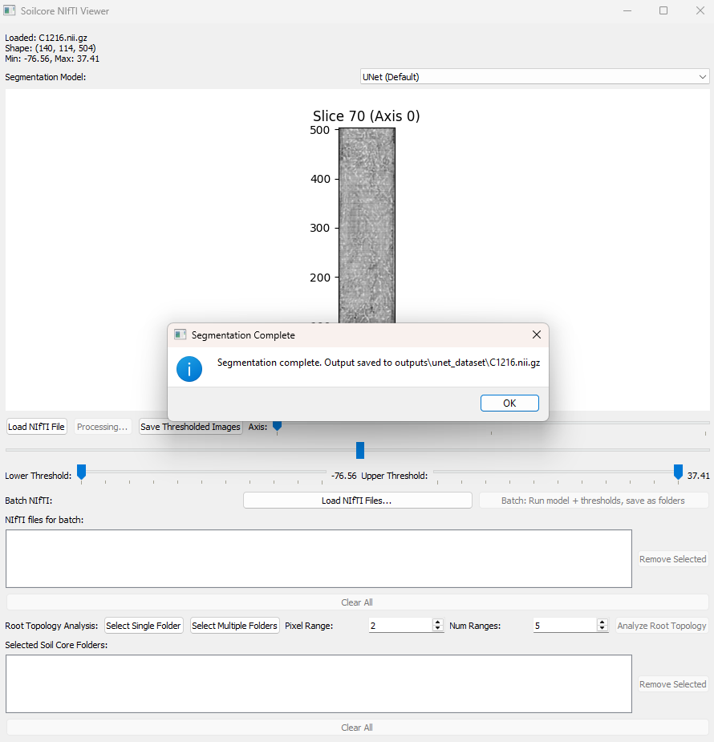
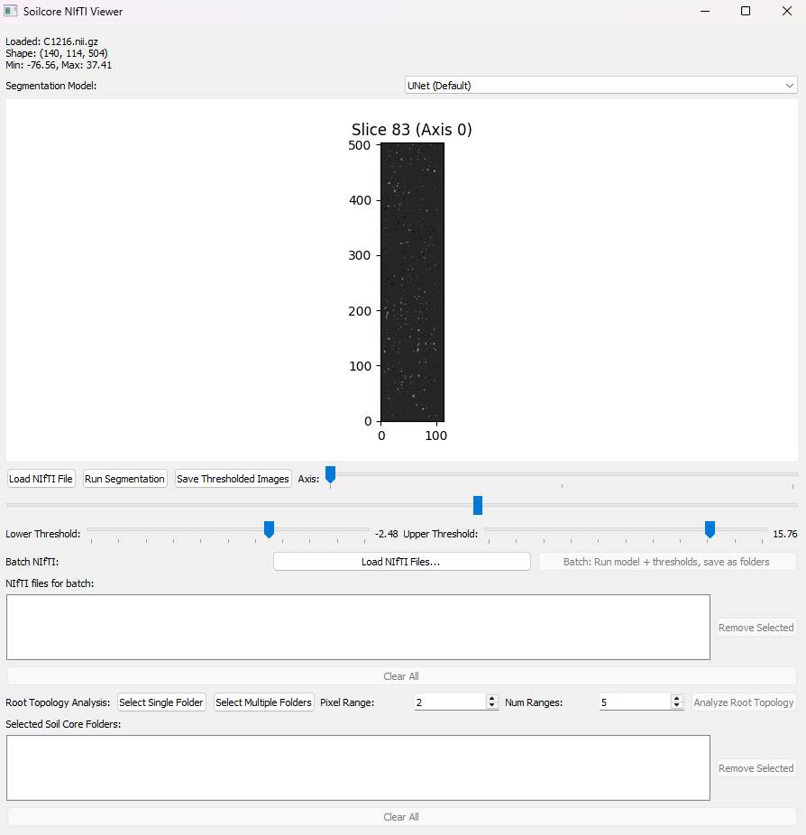
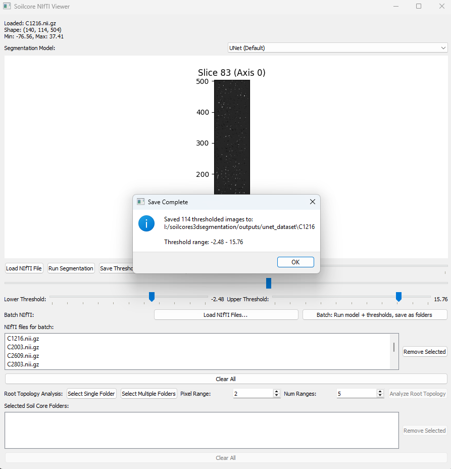
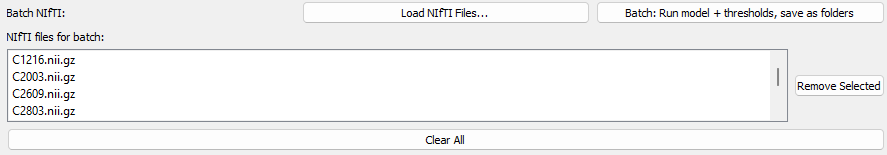

# GUI: Segmentation and Root Topology Analysis

This document describes how to use the `Soilcore NIfTI Viewer` graphical interface (`soilcore_gui.py`) to load, segment, threshold, and analyze 3D CT scans for root topology. We illustrate this with the sample file `C1216.nii.gz`.

## Launch

```bash
python soilcore_gui.py
```

---

## Step 1: Load the CT Scan

Click **"Load NIfTI File"**, locate your CT scan file in the file browser (e.g., `C1216.nii.gz`), and click **Open**.



---

## Step 2: Visualize the Raw Data

Once loaded, the middle slice of the scan will be shown. Use the **"Axis"** slider to change the orientation and the **bottom slider** to scroll through slices.



---

## Step 3: Run Segmentation

Select a model from the **Segmentation Model** dropdown (e.g., `UNETR (AdamW, 100k, 2 heads)`), then click **"Run Segmentation"**. The segmented volume will load automatically once processing is complete.



---

## Step 4: Apply a Threshold

Adjust the **Lower Threshold** and **Upper Threshold** sliders to remove unwanted noise or background from the segmentation output.



---

## Step 5: Save Thresholded Images

Click **"Save Thresholded Images"** and choose a directory. Binary PNG slices will be saved there, one per depth slice. A confirmation message will appear when complete.



---

## Alternative: Batch Processing

If you have multiple NIfTI files, you can process them all at once instead of repeating Steps 1–5 for each one.

**Recommended:** Before running a batch, follow Steps 1–4 on a representative core to find good threshold values. Adjust the **Lower** and **Upper Threshold** sliders until the segmentation looks correct — the batch will use those same values for every file.

Once the sliders are set, under *Batch NIfTI* click **"Load NIfTI Files..."** to select your files, then click **"Batch: Run model + thresholds, save as folders"**. Each file will be segmented, thresholded, and saved to its own folder. Continue from Step 6 with those output folders.



---

## Step 6: Select Folder with Thresholded Images

Under *Root Topology Analysis*, click **"Select Single Folder"** to load one core or **"Select Multiple Folders"** to load a parent directory containing multiple core folders.


---

## Step 7: Get Root Topology Results

Click **"Analyze Root Topology"**. A CSV and PNG file are saved in the output directory with total root length broken down by diameter range. A preview chart is also shown.


